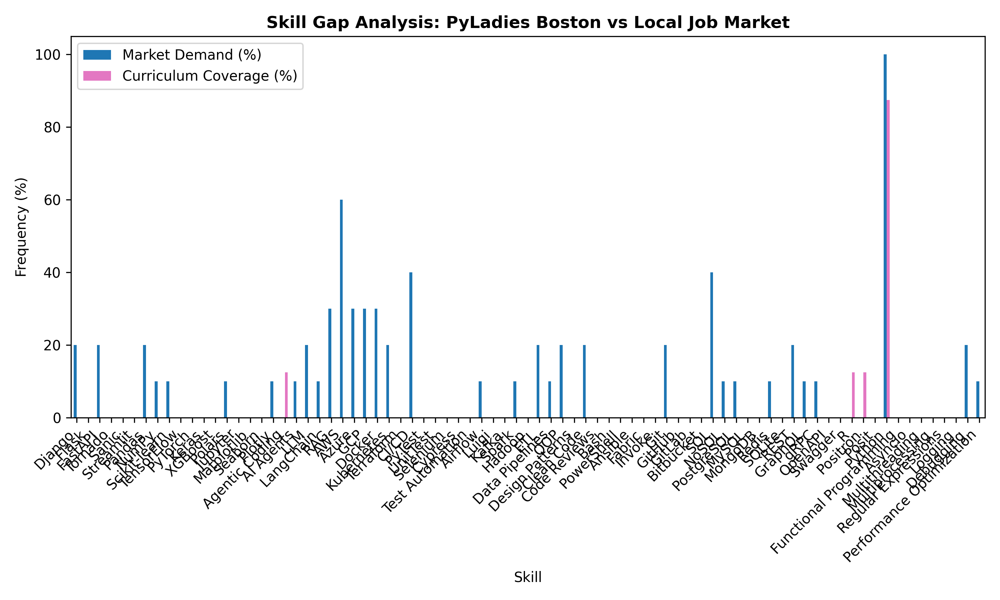

# PyLadies Skill Gap Analyzer 📊🔍

An automated data pipeline designed to analyze educational trends and identify "skill gaps" across local **PyLadies** chapters. By leveraging structured search data, this tool maps out existing chapter locations, extracts technologies taught in past events, and compares them with current developer community needs.

This project was built using **[SerpApi](https://serpapi.com)** to solve anti-bot scraping restrictions and access structured social profile data seamlessly.

---

## 🛠️ Powered by SerpApi

Instead of writing fragile and easily-blocked HTML scrapers for platform discovery, this application utilizes specialized engines provided by SerpApi to extract clean, reliable data:

1. **Google Search API (`site:` operator):** Used to dynamically discover PyLadies chapters listed on Meetup without triggers from Cloudflare protections. Read the [SerpApi Google Search API Documentation](https://serpapi.com).
2. **Instagram Profile API (`engine: instagram_profile`):** Used to securely pull biography descriptions and profile details from public local chapter accounts. Read the [SerpApi Instagram Profile API Documentation](https://serpapi.com).

This workflow perfectly demonstrates how **structured search results are vastly superior and easier to maintain than scraping raw HTML**.

---

## 🚀 Features

- **Automated Chapter Discovery:** Leverages Google's indexed database via SerpApi to discover valid chapter URLs.
- **Social Media Insight Extraction:** Inspects local chapters' public Instagram accounts using the specialized SerpApi social engine.
- **Skill Taxonomy Matching:** Cross-references extracted textual data against a predefined Python ecosystem taxonomy (e.g., Django, FastAPI, Data Science, Pandas).
- **Visual Analytics:** Automatically generates comparative bar charts and exports data into clean Markdown reporting files.

---

## 📂 Project Structure

The project follows a clean, modular python architecture separated by business logic constraints:

```text
pyladies-serpapi/
├── src/
│   ├── __init__.py          # Package initializer
│   ├── config.py            # Static variables and skill taxonomies
│   ├── data_fetcher.py      # Network calls using SerpApi engines
│   ├── analyzer.py          # Data processing and skill mapping logic
│   └── reporter.py          # Visual graph generation and Markdown reporting
├── main.py                  # CLI argument parser and pipeline orchestrator
├── requirements.txt         # Project dependencies
└── .env                     # Local environment credentials
```

---

## 💻 Installation & Setup

1. **Clone the repository:**
   ```bash
   git clone https://github.com
   cd pyladies-serpapi
   ```

2. **Set up a Python Virtual Environment:**
   ```bash
   python3 -m venv venv
   source venv/bin/activate
   ```

3. **Install Dependencies:**
   This project communicates with SerpApi through the official integration client.
   ```bash
   pip install -r requirements.txt
   ```
   *(Note: Check out the official [SerpApi Python SDK Repository](https://github.com) for more details on setup).*

4. **Environment Variables:**
   Create a `.env` file in the root directory and add your SerpApi token:
   ```env
   SERPAPI_KEY="your_secret_serpapi_api_key_here"
   ```

---

## 🎯 Usage

Run the orchestrator script using the command-line interface with the proper hyphenation flags (`--`).

### Basic Analysis
Analyze events hosted within the last few months:
```bash
python main.py --history-months 6
```

### Investigate a Specific Instagram Chapter
Pull biography profile insights using SerpApi's specialized social engine:
```bash
python main.py --instagram-user pyladiesbr
```

### Full Dump Configuration
Discover and rebuild the local chapters index mapping database:
```bash
python main.py --dump-chapters
```

---

## 📈 Outputs
All generated execution reports, data tables, and Matplotlib data visualization png figures are saved directly into the dynamically created `outputs/` folder.

---

## 📈 Featured Case Study: PyLadies Boston 🇺🇸

The **PyLadies Boston** chapter serves as our primary benchmark because it is one of the most active hubs in the global community. By analyzing their timeline, our pipeline successfully captured advanced, modern tech trends that standard tools miss.

### 📊 Real-Time Skill Alignment Visual
When running the pipeline, a dual-variable visualization chart is generated automatically inside the `outputs/` directory.



### 🔍 Key Insights & Analysis
Our taxonomy matching layer discovered highly relevant data points during the Boston analysis execution:

- **The Curriculum Pink Bars:** The pipeline successfully parsed 8 recent events from the chapter's RSS feed, capturing traditional fundamentals (`Python`) alongside bleeding-edge ecosystem topics like **"Agentic Coding"** (AI Agents) and **"Positron"** (the new Next-Generation IDE for Data Science by Posit).
- **The Market Demand Blue Bars:** By querying the live **SerpApi Google Jobs API** for *"Python developer jobs in Boston"*, the tool dynamically fetched active job descriptions to measure how frequently those exact technologies are requested by local employers.

This benchmark perfectly demonstrates the core value of the tool: identifying exactly when a local community's curriculum matches or anticipates real job market demands!

---
